# IAM Proof-of-Concept — Requirements Specification Document

> **Document Version:** 1.0  
> **Date:** June 2, 2026  
> **Classification:** Internal — Vendor Evaluation  
> **Prepared By:** Reverse-Engineered from Production Codebase  
> **Audience:** IAM Architects, Solution Engineers, Vendor Pre-Sales, Business Stakeholders

---

## Table of Contents

1. [Executive Summary](#1-executive-summary)
2. [Solution Overview](#2-solution-overview)
3. [Functional Requirements](#3-functional-requirements)
4. [Authorization Model Analysis](#4-authorization-model-analysis)
5. [Authentication Analysis](#5-authentication-analysis)
6. [User Roles and Permissions Matrix](#6-user-roles-and-permissions-matrix)
7. [Resource Model](#7-resource-model)
8. [Workflow Analysis](#8-workflow-analysis)
9. [API Analysis](#9-api-analysis)
10. [Database and Data Model Analysis](#10-database-and-data-model-analysis)
11. [Vendor Evaluation Requirements](#11-vendor-evaluation-requirements)
12. [Gap and Enhancement Opportunities](#12-gap-and-enhancement-opportunities)
13. [Appendix](#13-appendix)

---

## 1. Executive Summary

### 1.1 Purpose of the Application

This application is a **Honeywell B2B Partner Portal** proof-of-concept that demonstrates an enterprise-grade Identity and Access Management (IAM) and Fine-Grained Access Control (FGAC) architecture. The portal enables external partner and customer users to browse industrial product catalogs, place orders, request quotes, and manage shopping carts — with every data interaction governed by multi-layered authorization policies that reflect real-world B2B account relationships.

The explicit design goal, stated in the source code, is to model the **Honeywell Unified Authorization Fabric** — an enterprise authorization platform supporting multiple Strategic Business Groups (SBGs), multiple sales organizations, and diverse external user types operating across multiple sold-to accounts.

### 1.2 Business Objectives

1. **Demonstrate Fine-Grained Access Control** in a B2B commerce context where the same user may operate on behalf of multiple customer accounts, each with different sales organizations, currencies, and product portfolios.
2. **Validate an external authorization engine integration** (Permit.io) as a Policy Decision Point (PDP), with graceful fallback to local rules when the PDP is unavailable.
3. **Model a tool-entitlement-based authorization pattern** (ReBAC) where access to specific portal capabilities is granted through explicit tool assignments — mirroring the SFDC `portal_user__c / tool_access__c` pattern used in production.
4. **Provide a reference architecture** that can be presented to IAM vendors (Permit.io, Ping Identity, Auth0, Okta, Microsoft Entra, ForgeRock) as a specification for replication or replacement.
5. **Establish dual-layer security**: server-side enforcement via a centralized `canAccess()` function and client-side UX gating via a `PermissionGate` component — with clear separation of concerns between the two.

### 1.3 High-Level IAM Goals

| Goal | Implementation Status |
|---|---|
| OIDC-based federated authentication via enterprise IdP | Implemented (Ping Identity) |
| Role-Based Access Control (RBAC) | Implemented (3 roles) |
| Attribute-Based Access Control (ABAC) | Implemented (persona, sales org, account) |
| Relationship-Based Access Control (ReBAC) via tool entitlements | Implemented (4 tool types) |
| External Policy Decision Point (Permit.io) | Implemented with fallback |
| Multi-tenant / multi-account scoping | Implemented |
| Data-level authorization (row-level filtering) | Implemented |
| Price-level authorization (field masking) | Implemented |
| Session management with expiry enforcement | Implemented |
| Admin-only route and API protection | Implemented |
| Audit trace logging | Implemented (in-memory, SSE stream) |
| MFA | Not implemented |
| Access request / approval workflows | Partially implemented (schema only) |

---

## 2. Solution Overview

### 2.1 Application Description

The portal is a **Next.js 14 (App Router)** web application deployed as a server-side rendered (SSR) application with React client components for interactive UI. The backend runtime is **Node.js 18+**. Data persistence is provided by **Supabase** (managed PostgreSQL). Authorization policy management is externalizable to **Permit.io** (cloud or local Docker PDP).

The portal is styled to represent the Honeywell B2B brand with sidebar navigation, an account switcher, and a dark sidebar. Branding tokens (`#C8102E` Honeywell red) are consistent throughout the UI.

### 2.2 Major Modules

| Module | Description |
|---|---|
| **Authentication** | Ping Identity OIDC + PKCE flow; demo mode fallback |
| **Session Management** | httpOnly cookie-based sessions; JWT claim parsing |
| **CRM Service** | Supabase-first user/account/tool lookup with mock data fallback |
| **Authorization Engine** | `canAccess()` — delegates to Permit.io PDP or local tool-based ReBAC |
| **Product Catalog** | Sales-org-filtered product browsing with optional pricing visibility |
| **Order Management** | Account-scoped order creation and listing |
| **Quote Management** | Procurement-persona-gated quote creation and listing |
| **Cart** | User + account scoped shopping cart |
| **Admin Panel** | Live Permit.io policy matrix; demo user directory |
| **Account Switcher** | Multi-account context switcher with permission refresh |
| **Debug / Trace Console** | In-memory request trace viewer with SSE live stream (admin only) |

### 2.3 User Personas

Three distinct personas are modeled in the system, each representing a different tier of access:

| Persona | Name | Role | User Type | Accounts | Tools | Description |
|---|---|---|---|---|---|---|
| **Admin** | Miguel Patel | `admin` | Partner | 5 (all) | TL001, TL003, TL004, TL009 | Full access; IT Admin; GBE persona |
| **Buyer** | Carlos Johnson | `buyer` | Partner | 2 | TL003, TL004 | Order management + support; Procurement dept; GBE persona |
| **Viewer** | Sarah Chen | `viewer` | Customer | 1 | TL004, TL009 | Invoices + support only; Operations dept; general persona |

### 2.4 Supported User Journeys

1. **Demo Login** — Select a persona on the login page; skip IdP; immediate session creation.
2. **SSO Login** — Redirect to Ping Identity → PKCE code exchange → session cookie → redirect to `/home`.
3. **Browse Products** — View filtered product catalog; pricing visibility depends on `view_pricing` permission.
4. **Product Detail** — View individual product; add to cart (if permitted); request quote (if procurement persona).
5. **Manage Cart** — Add, view, and remove cart items scoped to user + selected account.
6. **Place Order** — Create order from cart; scoped to selected account.
7. **View Quotes** — List quotes for selected account; create quote (procurement persona only).
8. **Switch Account** — Select from authorized accounts; all permissions and data re-scope automatically.
9. **Account Dashboard** — View profile, all accounts, order history across all accounts, sales org summary.
10. **Admin Panel** — View live Permit.io policy matrix; browse demo user directory.
11. **Debug Console** — Live SSE trace stream of all API requests with auth context, upstream calls, tags (admin only).
12. **Logout** — Clear session; optionally redirect to Ping SSO end-session endpoint.

---

## 3. Functional Requirements

### 3.1 Authentication Requirements

#### FR-AUTH-001 — OIDC Login with PKCE

| Field | Value |
|---|---|
| **ID** | FR-AUTH-001 |
| **Name** | OpenID Connect Login with PKCE |
| **Description** | The system initiates an OIDC Authorization Code flow with PKCE (S256) when configured with valid Ping Identity credentials. The login endpoint generates a cryptographically random `code_verifier`, computes the `code_challenge = BASE64URL(SHA-256(verifier))`, stores the verifier in an httpOnly cookie (`iam_pkce_verifier`), and redirects the browser to the Ping authorization endpoint. On callback, the server validates the state parameter (CSRF check), retrieves the stored verifier, exchanges the authorization code for tokens via the Ping token endpoint, parses JWT claims, and establishes a session cookie. |
| **Business Value** | Prevents authorization code interception attacks; complies with OAuth 2.0 security best practices for confidential server-side clients. |
| **User Roles Involved** | All unauthenticated users |
| **Priority** | Critical |

#### FR-AUTH-002 — Demo Mode Bypass

| Field | Value |
|---|---|
| **ID** | FR-AUTH-002 |
| **Name** | Demo / Development Login Bypass |
| **Description** | When Ping Identity environment variables are absent, contain placeholder values, or `DEMO_MODE=true` is set, the login endpoint creates a pre-built `AuthSession` directly from a `persona` query parameter (`admin`, `buyer`, `viewer`) and stores it in the session cookie. No IdP round-trip occurs. Three pre-configured demo users are available on the login page. |
| **Business Value** | Enables rapid demonstration of authorization capabilities without live IdP configuration. |
| **User Roles Involved** | All demo users |
| **Priority** | High |

#### FR-AUTH-003 — Session Cookie Management

| Field | Value |
|---|---|
| **ID** | FR-AUTH-003 |
| **Name** | Secure Session Cookie |
| **Description** | The session is stored as a base64-encoded JSON object in an httpOnly cookie named `iam_session`. Cookie attributes: `httpOnly: true` (XSS protection), `secure: true` in production, `sameSite: lax` (CSRF protection), `maxAge` derived from JWT `exp` claim. Sessions are validated on every protected request by the Next.js Edge middleware. Expired sessions are deleted and the user is redirected to `/login?reason=session_expired`. |
| **Business Value** | Eliminates localStorage-based token storage; protects against XSS and CSRF attacks. |
| **User Roles Involved** | All authenticated users |
| **Priority** | Critical |

#### FR-AUTH-004 — Logout with SSO End-Session

| Field | Value |
|---|---|
| **ID** | FR-AUTH-004 |
| **Name** | Logout and SSO End-Session |
| **Description** | The `/api/auth/logout` endpoint clears all three auth cookies (`iam_session`, `iam_pkce_verifier`, `iam_oauth_state`). If Ping Identity is configured, the user is redirected to the Ping `signoff` endpoint with a `post_logout_redirect_uri` pointing back to `/login`, ensuring the SSO session is also terminated. In demo mode, the user is redirected directly to `/login`. |
| **Business Value** | Ensures complete session termination including upstream IdP session; prevents session reuse after logout. |
| **User Roles Involved** | All authenticated users |
| **Priority** | Critical |

#### FR-AUTH-005 — JWT Role Claim Mapping

| Field | Value |
|---|---|
| **ID** | FR-AUTH-005 |
| **Name** | JWT Custom Role Claim Extraction |
| **Description** | After token exchange, the server parses JWT claims using `decodeJwt` (from `jose`). The user role is extracted from the `role` claim, falling back to `custom:role`, and then defaulting to `viewer` if neither is present. Valid role values are `admin`, `buyer`, `viewer`. The role is embedded in the session and propagated via `x-user-role` header by the middleware. |
| **Business Value** | Enables IdP-driven role assignment without a separate user store lookup on every request. |
| **User Roles Involved** | All authenticated users |
| **Priority** | High |

#### FR-AUTH-006 — CSRF State Validation

| Field | Value |
|---|---|
| **ID** | FR-AUTH-006 |
| **Name** | OAuth State Parameter CSRF Protection |
| **Description** | A cryptographically random state is generated at login, stored in an httpOnly cookie (`iam_oauth_state`, 10-minute TTL), and validated on callback. State mismatch triggers cookie clearing and redirect to `/login?error=state_mismatch`. |
| **Business Value** | Prevents Cross-Site Request Forgery attacks on the OAuth callback endpoint. |
| **User Roles Involved** | All users initiating login |
| **Priority** | Critical |

---

### 3.2 Authorization Requirements

#### FR-AUTHZ-001 — Centralized Authorization Check Function

| Field | Value |
|---|---|
| **ID** | FR-AUTHZ-001 |
| **Name** | Single-Entry-Point Authorization |
| **Description** | All authorization decisions flow through `canAccess(userId, action, resource, context?, userRole?)`. This function first attempts a Permit.io PDP check; on PDP unavailability (connection error, TLS error) it falls back to the local tool-based ReBAC engine. The function fails closed (returns `false`) on any unexpected error. The authorization engine used (`permit.io` or `fallback`) is tracked per-request and surfaced in API responses and debug traces. |
| **Business Value** | Single point of policy enforcement; interchangeable PDP backends; consistent audit trail. |
| **User Roles Involved** | All authenticated users |
| **Priority** | Critical |

#### FR-AUTHZ-002 — Permit.io PDP Integration

| Field | Value |
|---|---|
| **ID** | FR-AUTHZ-002 |
| **Name** | External Policy Decision Point (Permit.io) |
| **Description** | When `PERMIT_API_KEY` is configured with a non-demo value, the `Permit` SDK client is initialized (singleton) pointing at `PERMIT_PDP_URL` (cloud or local Docker PDP). Each `canAccess()` call invokes `permit.check(userArg, action, resourceArg)` with user attributes (`persona`) and resource attributes (`allowedSalesOrgs`, `selectedAccountId`) passed inline. The PDP returns a boolean allow/deny. |
| **Business Value** | Externalizes policy management; enables policy-as-code; allows non-developer policy editors. |
| **User Roles Involved** | All authenticated users |
| **Priority** | High |

#### FR-AUTHZ-003 — Tool-Based ReBAC Fallback

| Field | Value |
|---|---|
| **ID** | FR-AUTHZ-003 |
| **Name** | Tool Entitlement ReBAC Fallback Engine |
| **Description** | When Permit.io is unavailable or not configured, `canAccess()` falls back to a local `toolBasedRebac()` function. This function maps approved tool IDs (sourced from CRM `user_tool_access` records) to permitted resource/action pairs: TL001 (e-Commerce) → `products:view`, `products:view_pricing`, `cart:*`; TL003 (Order Status) → `orders:view`, `orders:create`; TL004 (Customer Support) → `products:view` only (no pricing); TL009 (My Invoices) → `quotes:view`, `quotes:create` (admin only). Admin role and `isSuperUser` flag bypass all tool checks. |
| **Business Value** | Ensures the portal is functional without a live PDP; mirrors the production Honeywell tool catalogue model. |
| **User Roles Involved** | All authenticated users |
| **Priority** | High |

#### FR-AUTHZ-004 — Procurement Persona ABAC Gate

| Field | Value |
|---|---|
| **ID** | FR-AUTHZ-004 |
| **Name** | Procurement Persona Attribute Check for Quote Creation |
| **Description** | Creating a quote requires the `buyer` role AND the `procurement` persona attribute. The persona is sourced from the CRM (Supabase `users.persona` column, or mock data). It is passed to the PDP as a user attribute. In the local fallback, quote creation via TL009 is additionally restricted to `isAdmin` only (the fallback conservatively restricts quote creation). The intent encoded in the policy JSON is that `procurement` persona is the gate. |
| **Business Value** | Prevents unauthorized users from submitting quotes even if they hold the buyer role; enforces business rules about who is allowed to initiate procurement workflows. |
| **User Roles Involved** | buyer (procurement persona) |
| **Priority** | High |

#### FR-AUTHZ-005 — Sales Org ABAC Filter (Products)

| Field | Value |
|---|---|
| **ID** | FR-AUTHZ-005 |
| **Name** | Sales Organization Attribute Filter for Products |
| **Description** | Product access is scoped to the sales organizations associated with the user's currently selected account. The `allowedSalesOrgs` array is built from `account_sales_areas` records and passed as both a resource attribute to the PDP and as a SQL `IN` filter to Supabase. If `allowedSalesOrgs` is empty, a sentinel value (`__no_access__`) is used to ensure zero products are returned (fail-secure). This means two users hitting `GET /api/products` with different accounts see entirely different product catalogs from the same table. |
| **Business Value** | Enforces data isolation between sales organizations; users cannot access products outside their authorized business scope. |
| **User Roles Involved** | admin, buyer, viewer |
| **Priority** | Critical |

#### FR-AUTHZ-006 — Account Scope ABAC Filter (Orders, Quotes)

| Field | Value |
|---|---|
| **ID** | FR-AUTHZ-006 |
| **Name** | Account Scope Attribute Filter for Orders and Quotes |
| **Description** | Order and quote queries are filtered by the user's currently selected account ID (`selectedAccountId`). The account ID is extracted from the `x-account-id` request header (set by the client AccountSwitcher). Before applying the filter, the server verifies the user actually has access to the requested account via `userHasAccountAccess()`. Unauthorized account access returns HTTP 403. |
| **Business Value** | Prevents cross-account data leakage; users cannot query orders or quotes belonging to accounts they are not authorized for. |
| **User Roles Involved** | admin, buyer, viewer |
| **Priority** | Critical |

#### FR-AUTHZ-007 — Cart Scoping (User + Account)

| Field | Value |
|---|---|
| **ID** | FR-AUTHZ-007 |
| **Name** | Cart Dual-Scope Filter (User + Account) |
| **Description** | Cart items are filtered by both `user_id` (the authenticated user) and `account_id` (the selected account). Switching accounts presents a different, isolated cart. Cart items are upserted using a unique constraint on `(user_id, account_id, product_id)` — adding the same product again updates the quantity. |
| **Business Value** | Supports multi-account buyers maintaining separate procurement contexts per account; ensures cart data cannot be shared or accessed across accounts. |
| **User Roles Involved** | buyer (requires TL001 tool) |
| **Priority** | High |

#### FR-AUTHZ-008 — Pricing Field Masking

| Field | Value |
|---|---|
| **ID** | FR-AUTHZ-008 |
| **Name** | Price Field Authorization Masking |
| **Description** | Users without the `view_pricing` permission have product prices replaced with `0` (integer) before the API response is returned. This masking occurs at the server — the raw price is never transmitted. On the frontend, the price column is also hidden via `hasPermission('view_pricing', 'products')`. Both layers operate independently. |
| **Business Value** | Protects commercial pricing information from unauthorized disclosure; supports tiered access where support users can view the catalog without seeing pricing. |
| **User Roles Involved** | viewer (no pricing), buyer with TL001 (pricing visible), admin (pricing visible) |
| **Priority** | High |

#### FR-AUTHZ-009 — Edge Middleware Route Protection

| Field | Value |
|---|---|
| **ID** | FR-AUTHZ-009 |
| **Name** | Next.js Edge Middleware for Route-Level Access Control |
| **Description** | A Next.js middleware runs on the Edge runtime before every matched request. It enforces: (1) public routes (`/login`, `/api/auth/*`, `/403`) bypass authentication; (2) all other routes require a valid, non-expired session cookie; (3) `/admin` routes redirect non-admin users to `/403`; (4) the middleware injects trusted `x-user-id` and `x-user-role` headers for downstream route handlers. |
| **Business Value** | First line of defense before any route handler executes; prevents unauthenticated access at the edge; enforces admin route isolation. |
| **User Roles Involved** | All users |
| **Priority** | Critical |

#### FR-AUTHZ-010 — Admin-Only API Endpoints

| Field | Value |
|---|---|
| **ID** | FR-AUTHZ-010 |
| **Name** | Admin Role Enforcement on Privileged APIs |
| **Description** | The following API endpoints are admin-only and enforce the check within the route handler: `GET /api/admin/permit-policy`, `GET /api/debug/traces`, `DELETE /api/debug/traces`, `GET /api/debug/traces/stream`. Non-admin callers receive HTTP 403. |
| **Business Value** | Protects sensitive policy and audit data from non-privileged users. |
| **User Roles Involved** | admin |
| **Priority** | Critical |

#### FR-AUTHZ-011 — Client-Side Permission Gating (UX Only)

| Field | Value |
|---|---|
| **ID** | FR-AUTHZ-011 |
| **Name** | Frontend Permission Gate Components |
| **Description** | The `PermissionGate` React component conditionally renders children only when `hasPermission(action, resource)` returns true. `usePermission()` and `usePermissions()` hooks provide reactive access to the `PermissionMap` loaded from `GET /api/auth/permissions`. A `RoleGate` component provides role-based rendering. All components load false while permissions are loading. Source comments explicitly note: "This is UX gating, NOT security enforcement." |
| **Business Value** | Consistent, centrally managed client-side access control; reduces accidental UI exposure of features users cannot use. |
| **User Roles Involved** | All authenticated users |
| **Priority** | Medium |

#### FR-AUTHZ-012 — Permission Map Endpoint

| Field | Value |
|---|---|
| **ID** | FR-AUTHZ-012 |
| **Name** | Bulk Permission Resolution Endpoint |
| **Description** | `GET /api/auth/permissions` resolves 10 permission checks in parallel for the current user and selected account context. Returns a `PermissionMap` (e.g. `{ "view:products": true, "create:quotes": false }`), plus the active auth engine (`permit.io` or `fallback`), data source (`supabase` or `mock`), user profile, selected account, tool access grants, and approved tool IDs. The frontend calls this on load and on every account switch. |
| **Business Value** | Single API call for all permission data needed to render the portal UI; enables accurate reflection of PDP decisions in the UI. |
| **User Roles Involved** | All authenticated users |
| **Priority** | High |

---

### 3.3 User Management Requirements

#### FR-USR-001 — CRM-Sourced User Profile

| Field | Value |
|---|---|
| **ID** | FR-USR-001 |
| **Name** | User Profile from CRM Data Source |
| **Description** | Each user has a rich profile sourced from Supabase CRM tables: `id` (matches Ping JWT `sub`), `honId` (Honeywell SSO ID), `contactId` (SFDC contact ID), `name`, `email`, `phone`, `department`, `role`, `persona`, `userType` (Partner/Customer/Internal), `isSuperUser`, `active_sales_area`. The `crmService` module attempts Supabase lookup first, falling back to mock data if the user is not found in the database. |
| **Business Value** | Decouples identity (Ping JWT) from entitlement profile (CRM); allows CRM-managed attributes to drive authorization decisions. |
| **User Roles Involved** | All authenticated users |
| **Priority** | High |

#### FR-USR-002 — Multi-Account Association

| Field | Value |
|---|---|
| **ID** | FR-USR-002 |
| **Name** | User-to-Account Multi-Tenancy |
| **Description** | Users can be associated with one or more accounts via the `user_accounts` junction table. Each account has its own set of sales organizations. The user's active context (permissions, visible products, orders, quotes) is always scoped to one selected account at a time. Account membership is validated on every request via `userHasAccountAccess()`. Admin users are associated with all five accounts. |
| **Business Value** | Supports enterprise B2B scenarios where a buyer manages procurement for multiple entities (e.g., different subsidiaries or regions). |
| **User Roles Involved** | All authenticated users |
| **Priority** | Critical |

#### FR-USR-003 — Account Context Switching

| Field | Value |
|---|---|
| **ID** | FR-USR-003 |
| **Name** | Dynamic Account Context Switch |
| **Description** | The `AccountSwitcher` component in the Navbar allows users to select from their authorized accounts. On switch: (1) the new `accountId` is set in `localStorage` for persistence across page refreshes; (2) the `AccountContext` re-fetches the user context from `/api/crm/user-context/me?accountId=...`; (3) the `AuthContext` refreshes permissions with `x-account-id` header; (4) all data-level filters (sales orgs, account ID) are updated. The selected account is persisted in `localStorage` key `iam_selected_account`. |
| **Business Value** | Enables seamless multi-account B2B workflows; permissions and data views reconfigure automatically on account switch. |
| **User Roles Involved** | Users with multiple accounts |
| **Priority** | High |

#### FR-USR-004 — Tool Access Entitlements

| Field | Value |
|---|---|
| **ID** | FR-USR-004 |
| **Name** | Tool Access Grant Management |
| **Description** | Each user has explicit tool access grants stored in `user_tool_access`. Each grant has: `master_tool_id` (TL001, TL003, TL004, TL009), `tool_name`, `status` (Approved/Pending/Rejected/Revoked), `requested_date`, `granted_date`. Only `Approved` tools are included in `approvedToolIds` used for authorization checks. The tool grant history (including pending/rejected states) is maintained for audit purposes. |
| **Business Value** | Enables fine-grained, individually managed tool access; status lifecycle supports access request and revocation workflows. |
| **User Roles Involved** | All authenticated users |
| **Priority** | High |

---

### 3.4 Administration Requirements

#### FR-ADMIN-001 — Policy Matrix Viewer

| Field | Value |
|---|---|
| **ID** | FR-ADMIN-001 |
| **Name** | Live Authorization Policy Matrix |
| **Description** | The admin panel displays a live matrix of roles × resources × allowed actions, fetched from the Permit.io management API (`GET /v2/schema/{project}/{env}/roles` and `/resources`). The matrix shows which actions each role is permitted on each resource. When Permit.io is not configured, the panel displays an "unavailable" state with explanation. Includes a "Demo Users" tab listing all three demo personas with their accounts and tool assignments. |
| **Business Value** | Provides visibility into the current authorization policy without requiring access to the Permit.io dashboard; useful for auditors and business stakeholders. |
| **User Roles Involved** | admin |
| **Priority** | Medium |

#### FR-ADMIN-002 — Debug Trace Console

| Field | Value |
|---|---|
| **ID** | FR-ADMIN-002 |
| **Name** | Real-Time API Authorization Trace Console |
| **Description** | A debug page (`/debug`) provides a live trace of all API requests. Each trace entry captures: `id`, `timestamp`, HTTP method and URL, `userId`, `userRole`, request headers (filtered), query parameters, HTTP response status, response time (ms), upstream calls (service, method, URL, status), and tags (auth engine used, data source, account context). Traces are stored in-memory (last 200 entries). Live updates are streamed via Server-Sent Events from `GET /api/debug/traces/stream`. The debug page allows filtering and clearing traces. Admin-only access. |
| **Business Value** | Enables real-time observation of authorization decisions during demonstrations or debugging; provides per-request evidence of which auth engine was used. |
| **User Roles Involved** | admin |
| **Priority** | Medium |

---

### 3.5 Product Catalog Requirements

#### FR-PROD-001 — Sales-Org-Filtered Product Catalog

| Field | Value |
|---|---|
| **ID** | FR-PROD-001 |
| **Name** | Sales Organization Filtered Product Catalog |
| **Description** | The product catalog only displays products whose `sales_org_id` is in the user's `allowedSalesOrgs` for the selected account. Products are sorted by category then name. The API response includes `meta.allowedSalesOrgs` and `meta.pricingVisible` for client transparency. Products from different sales organizations (BA, PT, PA, IA) are visually distinguished by color coding in the UI. |
| **Business Value** | Users only see products relevant to their business relationship; prevents cross-SBG data leakage. |
| **User Roles Involved** | admin, buyer (TL001), viewer (TL004 — no pricing) |
| **Priority** | Critical |

#### FR-PROD-002 — Product Detail with Add-to-Cart

| Field | Value |
|---|---|
| **ID** | FR-PROD-002 |
| **Name** | Product Detail Page with Permission-Gated Actions |
| **Description** | The product detail page is wrapped in a `PermissionGate` requiring `view:products`. The page displays product metadata, a pricing section (visible only with `view_pricing` permission), an add-to-cart button (visible only with `create:cart` permission), and a "Request Quote" button. If the user lacks product view permission, an `AccessDenied` component is rendered. |
| **Business Value** | Consistent access enforcement at the page level, not just navigation. |
| **User Roles Involved** | admin, buyer |
| **Priority** | High |

---

### 3.6 Order Management Requirements

#### FR-ORDER-001 — Account-Scoped Order Listing

| Field | Value |
|---|---|
| **ID** | FR-ORDER-001 |
| **Name** | Account-Scoped Order History |
| **Description** | `GET /api/orders` returns orders filtered by the selected account ID. Each order includes nested `order_items` with product name, quantity, and unit price. Orders are sorted by creation date descending. Requires `view:orders` permission (linked to TL003 tool grant). |
| **Business Value** | Users only see orders placed under their selected account; prevents cross-account order visibility. |
| **User Roles Involved** | admin, buyer (TL003) |
| **Priority** | High |

#### FR-ORDER-002 — Order Creation

| Field | Value |
|---|---|
| **ID** | FR-ORDER-002 |
| **Name** | Order Creation with Line Items |
| **Description** | `POST /api/orders` creates an order with one or more line items. Requires `create:orders` permission. The order is associated with the selected account ID and the authenticated user ID. Total is computed server-side by summing `unitPrice × quantity`. Initial status is `pending`. Order item records are inserted transactionally after order creation. |
| **Business Value** | Transactional order capture with authorization enforcement at creation time. |
| **User Roles Involved** | buyer (TL003), admin |
| **Priority** | High |

#### FR-ORDER-003 — Cross-Account Dashboard Orders

| Field | Value |
|---|---|
| **ID** | FR-ORDER-003 |
| **Name** | Cross-Account Order Aggregation for Dashboard |
| **Description** | `GET /api/dashboard/orders` returns up to 20 recent orders across all accounts the user has access to (not limited to the selected account). This is used exclusively by the Account Dashboard page to show an aggregated view. This endpoint uses session-based account lookup rather than the `x-account-id` header. |
| **Business Value** | Provides an executive-level view of all order activity without requiring account switching. |
| **User Roles Involved** | admin, buyer, viewer (any authenticated user) |
| **Priority** | Medium |

---

### 3.7 Quote Management Requirements

#### FR-QUOTE-001 — Procurement-Gated Quote Creation

| Field | Value |
|---|---|
| **ID** | FR-QUOTE-001 |
| **Name** | Procurement Persona Required for Quote Creation |
| **Description** | `POST /api/quotes` enforces both tool-level (TL009 required) and persona-level (`procurement`) authorization via `canAccess(userId, 'create', 'quotes', context, role)`. The `procurement_persona_quotes` ABAC condition in `conditions.json` specifies this as a `user_attribute` check. A draft quote is created in Supabase with a `valid_until` date and associated `quote_items` with optional `discount_pct` per line. Total is computed server-side after applying per-item discounts. |
| **Business Value** | Enforces procurement governance; only designated procurement users can initiate formal quotes. |
| **User Roles Involved** | buyer (procurement persona, TL009), admin |
| **Priority** | High |

#### FR-QUOTE-002 — Quote Status Lifecycle

| Field | Value |
|---|---|
| **ID** | FR-QUOTE-002 |
| **Name** | Quote Status State Machine (Schema-Defined) |
| **Description** | The `quotes` table enforces a status check constraint: `draft`, `submitted`, `approved`, `rejected`, `expired`. Valid until (`valid_until`) date is stored per quote. Quote items support a `discount_pct` field for line-level discounting. **Note: No approval workflow UI is implemented; the status lifecycle is defined at the schema level only.** |
| **Business Value** | Schema is ready to support a full approval workflow when the UI is built. |
| **User Roles Involved** | buyer, admin (approval roles not yet implemented) |
| **Priority** | Medium (partial) |

---

## 4. Authorization Model Analysis

### 4.1 RBAC — Role-Based Access Control

Three roles are defined in `permit/policies/roles.json`:

| Role | Description | Key Permissions |
|---|---|---|
| `admin` | Full access to all resources | All actions on all resources including `admin_dashboard:view` and `users:manage` |
| `buyer` | Standard partner user | `products:view`, `products:view_pricing`, `orders:view`, `orders:create`, `quotes:view`, `cart:*`, `pricing:view_pricing` |
| `viewer` | Read-only customer | `products:view`, `orders:view` only |

Roles are stored in the JWT (`role` claim), embedded in the session cookie, and enforced at both middleware and route-handler layers.

### 4.2 ABAC — Attribute-Based Access Control

Three ABAC conditions are defined in `permit/policies/conditions.json`:

| Condition ID | Name | Target Permissions | Logic |
|---|---|---|---|
| `sales_org_filter` | Sales Org Access | `products:view`, `products:view_pricing` | `user.allowedSalesOrgs CONTAINS resource.sales_org_id` |
| `account_access` | Account Scope | `orders:view/create`, `quotes:view/create` | `user.selectedAccountId EQUALS resource.account_id` |
| `procurement_persona_quotes` | Procurement Persona Gate | `quotes:create` | `user.persona EQUALS "procurement"` |

User attributes passed to the PDP per check:
- `persona` (from CRM)
- `allowedSalesOrgs` (derived from selected account's sales org list)
- `selectedAccountId` (from `x-account-id` request header)

### 4.3 ReBAC — Relationship-Based Access Control

The tool entitlement model establishes a **user → tool → resource** relationship graph:

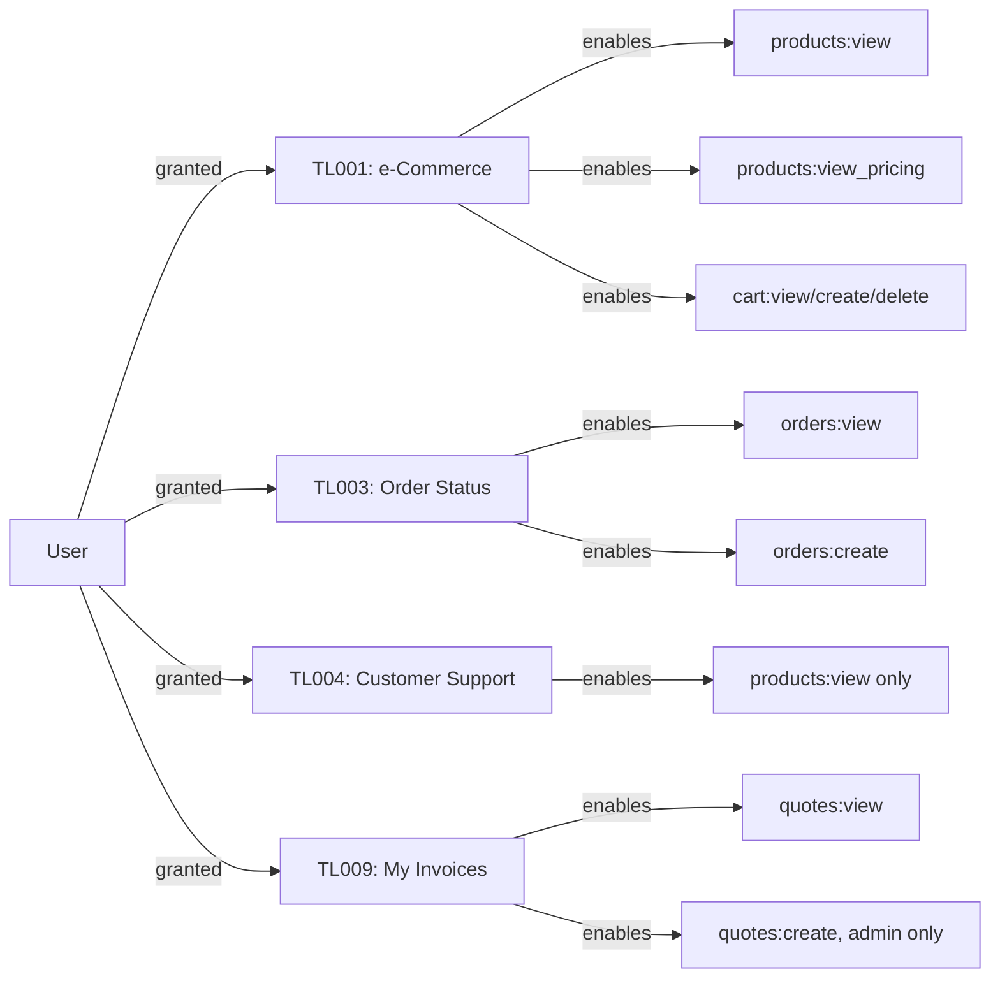

Tool grants are persisted in `user_tool_access` with a status lifecycle (`Approved`, `Pending`, `Rejected`, `Revoked`). Only `Approved` tools contribute to the `approvedToolIds` set used in authorization checks.

### 4.4 Policy-Based Access Control

The external Permit.io PDP is the primary authorization decision-maker when configured. The PDP evaluates RBAC, ABAC conditions, and resource attributes simultaneously. The local fallback (`toolBasedRebac`) replicates the same decision logic in code.

### 4.5 Resource Hierarchy

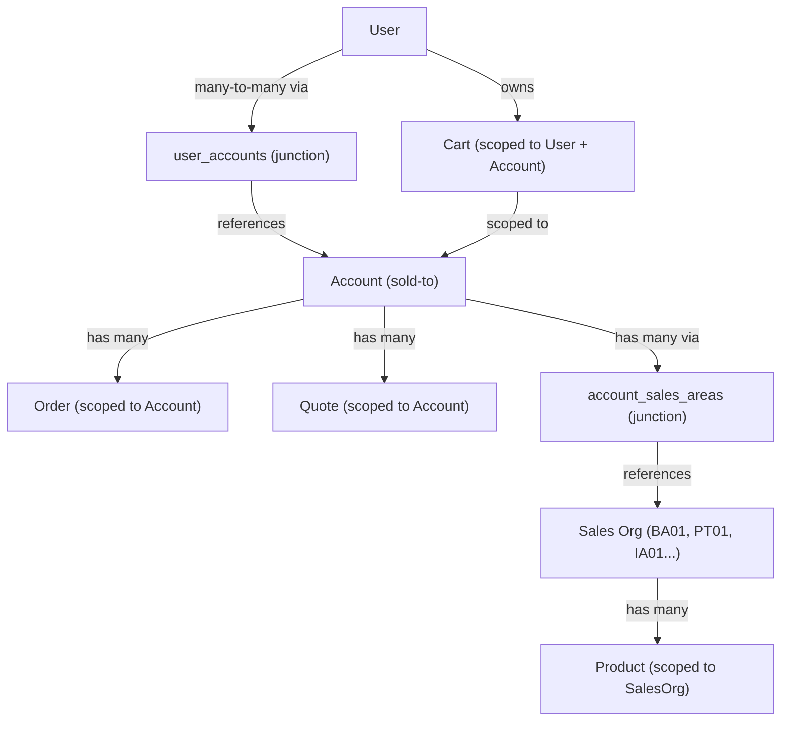

### 4.6 Role Hierarchy

No formal role inheritance is implemented. The three roles are flat. Admin access is granted through an explicit role check rather than role inheritance. The `isSuperUser` flag exists on the user model and, when true, grants the same access as admin role — but is currently unused in the demo data.

### 4.7 Permission Inheritance

No explicit permission inheritance chains are implemented. Role-to-permission assignments are flat mappings in the Permit.io schema. The `viewer` role is a strict subset of `buyer`, which is a strict subset of `admin`.

### 4.8 Conditional Access Logic

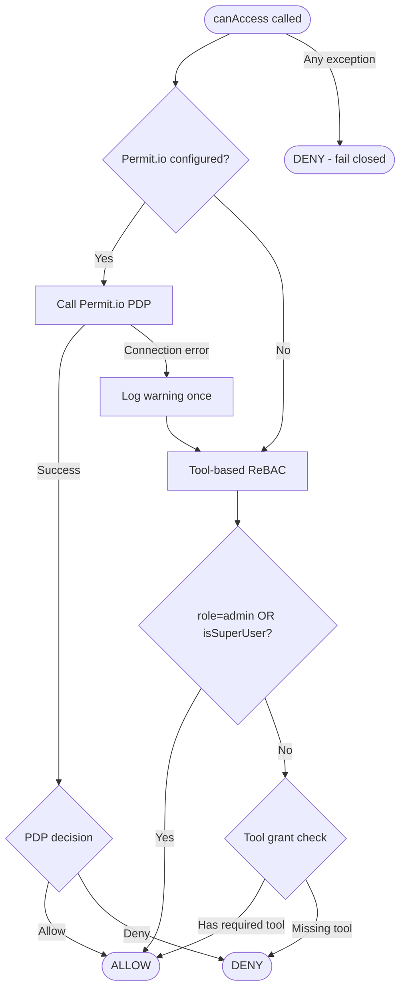

### 4.9 Fine-Grained Authorization Rules

| Rule | Implementation |
|---|---|
| Products scoped to sales orgs | SQL `IN (allowedSalesOrgs)` filter applied before DB query |
| Pricing hidden without `view_pricing` | Price field set to `0` in API response; never transmitted raw |
| Orders/quotes scoped to selected account | SQL `eq('account_id', selectedAccountId)` filter |
| Cart scoped to user AND account | SQL `eq('user_id', userId).eq('account_id', accountId)` |
| Admin route access | Middleware redirect to `/403`; API returns 403 |
| Cross-user context access denied | `/api/crm/user-context/[userId]` — non-admin cannot request another user's context |
| Quote creation requires procurement persona | ABAC condition checked via PDP or local attribute check |
| Unauthorized account blocked | `userHasAccountAccess()` called on every request with `x-account-id` |

### 4.10 Segregation of Duties

| SoD Rule | Implementation |
|---|---|
| Admin cannot be impersonated | Role is extracted from JWT (IdP-signed) or session; no client-side role override |
| Cart access requires eCommerce tool (TL001) | Tool check independent of role |
| Quote creation requires procurement persona | Independent of role; additive attribute gate |
| Debug console admin-only | Double enforcement: middleware + route handler |
| User context lookup: self only (non-admin) | Route-level check: `targetUserId !== session.userId && role !== 'admin'` → 403 |

---

## 5. Authentication Analysis

### 5.1 Login Methods

| Method | Description | Status |
|---|---|---|
| **OIDC Authorization Code + PKCE** | Full Ping Identity OIDC flow with S256 code challenge | Implemented |
| **Demo persona selection** | Direct session creation from `/api/auth/login?persona=` | Implemented |

### 5.2 MFA Capabilities

**Not implemented.** No MFA step-up, MFA enrollment, or MFA verification logic exists in the codebase. MFA would need to be handled entirely by the Ping Identity IdP and would be transparent to the application layer.

### 5.3 Session Management

| Property | Value |
|---|---|
| Storage | httpOnly cookie (`iam_session`) |
| Encoding | Base64-encoded JSON (`AuthSession`) |
| Contents | `userId`, `email`, `name`, `role`, `accessToken`, `expiresAt` |
| Expiry | Derived from JWT `exp` claim; fallback 1 hour |
| Validation | Expiry checked in session module; token structure validated; expired sessions deleted |
| Invalidation | `clearAuthCookies()` on logout (all 3 cookies deleted) |
| PKCE verifier TTL | 10 minutes (`iam_pkce_verifier` cookie) |
| State TTL | 10 minutes (`iam_oauth_state` cookie) |

### 5.4 Token Handling

| Token | Source | Usage |
|---|---|---|
| **Access Token** | Ping token endpoint | Stored in session; not used for downstream API calls in the PoC |
| **ID Token** (implicit) | Ping token endpoint | Claims parsed by `parseJwtClaims()` using `decodeJwt` from `jose`; not signature-verified post-callback |

> **Security Note:** JWT signature verification (`verifyJwt`) is referenced but the current `getSession()` implementation notes that it does NOT verify the JWT signature — it parses claims for UI rendering. The comment in `session.ts` states: "This does NOT verify the JWT signature — use verifySession() for security-critical checks." A `verifySession()` function is referenced but not shown as implemented in the reviewed code.

### 5.5 Identity Provider Integration

| IdP | Integration Type | Configuration |
|---|---|---|
| **Ping Identity (PingOne)** | OIDC Authorization Code + PKCE | `PING_ISSUER`, `PING_CLIENT_ID`, `PING_CLIENT_SECRET`, `PING_REDIRECT_URI`, `PING_SCOPES` env vars |

Derived Ping endpoints:
- Authorization: `{PING_ISSUER}/authorize`
- Token: `{PING_ISSUER}/token`
- End Session: `{PING_ISSUER}/signoff`
- JWKS: `{PING_ISSUER}/jwks`

### 5.6 User Lifecycle Management

| Event | Handling |
|---|---|
| **First login** | Session created from JWT claims; CRM lookup by `userId` (JWT `sub`) |
| **Unknown user** | Falls back to mock data; creates minimal viewer-role context |
| **Account switch** | Context re-fetched from CRM; permissions refreshed |
| **Session expiry** | Middleware detects expired `expiresAt`; clears cookie; redirects to login |
| **Logout** | All auth cookies cleared; optional Ping SSO end-session redirect |
| **Tool grant change** | Requires re-login or permission refresh (no real-time push mechanism) |
| **Role change** | Requires re-login (role embedded in JWT) |

---

## 6. User Roles and Permissions Matrix

### 6.1 Full Permission Matrix

| Permission | Admin | Buyer (TL001+TL003+TL009) | Buyer (TL003 only) | Buyer (TL004 only) | Viewer |
|---|---|---|---|---|---|
| `view:products` | ✅ | ✅ (TL001) | ❌ | ✅ (TL004, no pricing) | ❌ |
| `view_pricing:products` | ✅ | ✅ (TL001) | ❌ | ❌ | ❌ |
| `create:products` | ✅ | ❌ | ❌ | ❌ | ❌ |
| `update:products` | ✅ | ❌ | ❌ | ❌ | ❌ |
| `delete:products` | ✅ | ❌ | ❌ | ❌ | ❌ |
| `view:orders` | ✅ | ✅ (TL003) | ✅ (TL003) | ❌ | ❌ |
| `create:orders` | ✅ | ✅ (TL003) | ✅ (TL003) | ❌ | ❌ |
| `update:orders` | ✅ | ❌ | ❌ | ❌ | ❌ |
| `delete:orders` | ✅ | ❌ | ❌ | ❌ | ❌ |
| `view:quotes` | ✅ | ✅ (TL009) | ❌ | ✅ (TL009) | ❌ |
| `create:quotes` | ✅ | ✅ (TL009 + procurement persona) | ❌ | ❌ | ❌ |
| `update:quotes` | ✅ | ❌ | ❌ | ❌ | ❌ |
| `delete:quotes` | ✅ | ❌ | ❌ | ❌ | ❌ |
| `view:cart` | ✅ | ✅ (TL001) | ❌ | ❌ | ❌ |
| `create:cart` | ✅ | ✅ (TL001) | ❌ | ❌ | ❌ |
| `delete:cart` | ✅ | ✅ (TL001) | ❌ | ❌ | ❌ |
| `view:admin_dashboard` | ✅ | ❌ | ❌ | ❌ | ❌ |
| `manage:users` | ✅ | ❌ | ❌ | ❌ | ❌ |
| `view_pricing:pricing` | ✅ | ✅ (TL001) | ❌ | ❌ | ❌ |

### 6.2 Demo Persona Permission Summary

| Permission | Miguel Patel (Admin) | Carlos Johnson (Buyer, TL003+TL004) | Sarah Chen (Viewer, TL004+TL009) |
|---|---|---|---|
| View products | ✅ | ✅ (via TL004, no pricing) | ❌ |
| View pricing | ✅ | ❌ | ❌ |
| Manage cart | ✅ | ❌ | ❌ |
| View orders | ✅ | ✅ | ❌ |
| Create orders | ✅ | ✅ | ❌ |
| View quotes | ✅ | ❌ | ✅ |
| Create quotes | ✅ | ❌ | ❌ |
| Admin dashboard | ✅ | ❌ | ❌ |
| Debug console | ✅ | ❌ | ❌ |

### 6.3 Sidebar Navigation by Role

| Nav Item | Tool Required | Admin | Buyer (TL003+TL004) | Viewer |
|---|---|---|---|---|
| Home | None | ✅ | ✅ | ✅ |
| Account Dashboard | None | ✅ | ✅ | ✅ |
| Products | TL001 or TL004 | ✅ | ✅ (TL004) | ❌ |
| Orders | TL003 | ✅ | ✅ | ❌ |
| Invoices/Quotes | TL009 | ✅ | ❌ | ✅ |
| Cart | TL001 | ✅ | ❌ | ❌ |
| Admin | admin role | ✅ | ❌ | ❌ |

---

## 7. Resource Model

### 7.1 Resource Inventory

| Resource Key | Name | Actions | Scope | Attributes |
|---|---|---|---|---|
| `products` | Products | view, view_pricing, create, update, delete | Sales Organization | `sales_org_id` |
| `orders` | Orders | view, create, update, delete | Account | `account_id` |
| `quotes` | Quotes | view, create, update, delete | Account | `account_id` |
| `cart` | Cart | view, create (add), delete (remove) | User + Account | (none — implicit from auth context) |
| `admin_dashboard` | Admin Dashboard | view | Global | (none) |
| `users` | Users | manage | Global | (none) |
| `pricing` | Pricing | view_pricing | Product | (via products resource) |

### 7.2 Resource Hierarchy

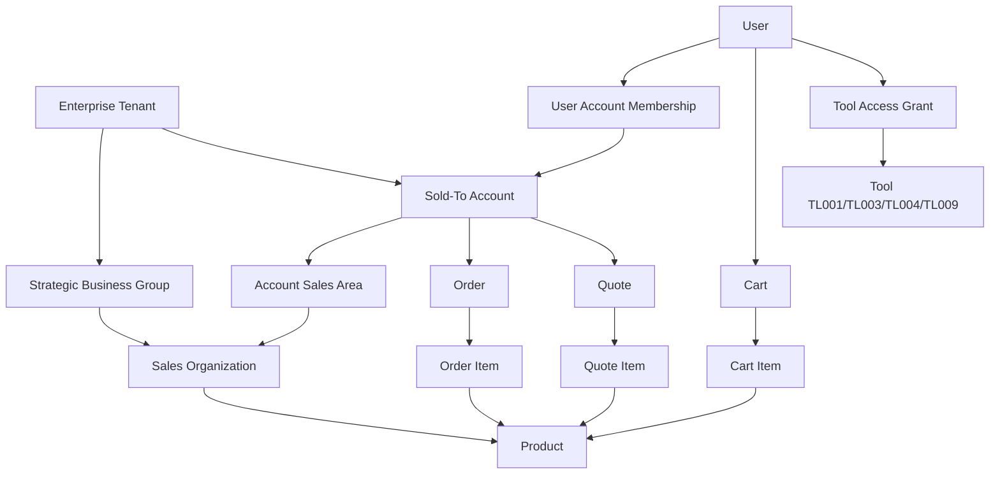

### 7.3 Ownership Models

| Resource | Owned By | Shared With |
|---|---|---|
| Cart | User + Account | Not shared; per-user per-account |
| Orders | Account | All authorized users of that account |
| Quotes | Account | All authorized users of that account |
| Products | Sales Organization | All users authorized for that sales org |
| Tool Grants | User | Not shared |

### 7.4 Sales Organization Taxonomy

| Prefix | Division | Color Code | Example Orgs |
|---|---|---|---|
| BA | Building Automation | Red (#dc2626) | BA01 (USD), BA02 (EUR) |
| PT | Process Technology | Green (#16a34a) | PT01 (USD), PT02 (EUR), PT03 (GBP) |
| PA | Process Automation | Blue (#2563eb) | PA01 (USD), PA02 (EUR) |
| IA | Industrial Automation | Yellow (#ca8a04) | IA01 (USD), IA02 (EUR) |

---

## 8. Workflow Analysis

### 8.1 Authentication Workflow

#### 8.1.1 OIDC Login Flow (Ping Identity Configured)

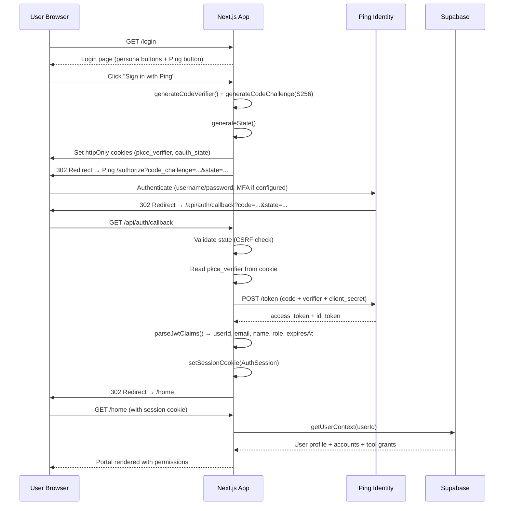

#### 8.1.2 Demo Login Flow

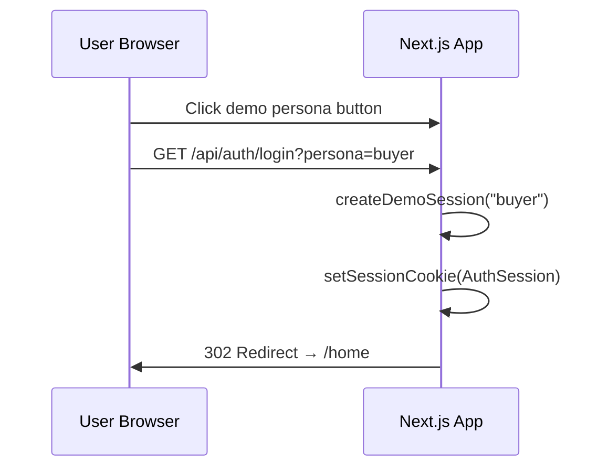

### 8.2 Account Context Switch Workflow

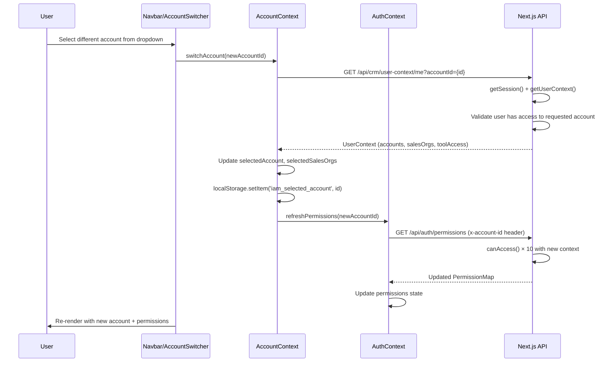

### 8.3 Authorization Decision Workflow (per API request)

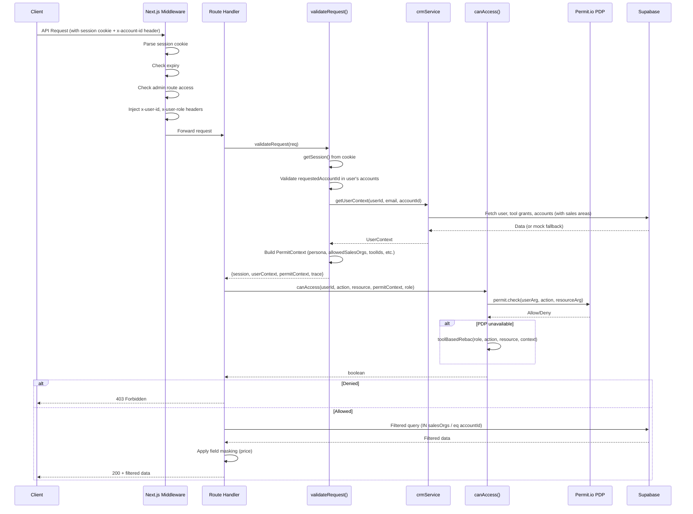

### 8.4 Tool Access Grant Lifecycle (Partially Implemented)

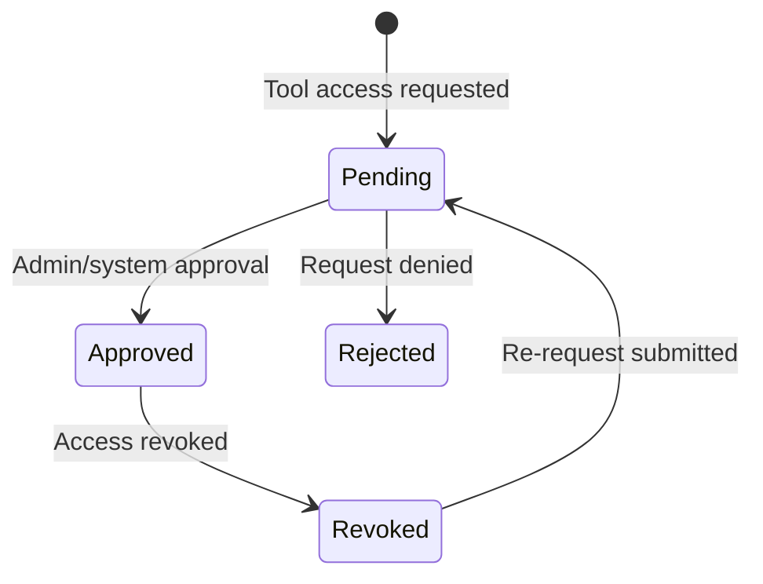

> **Note:** The state machine is defined in the `ToolStatus` type and `user_tool_access.status` column. The transition UI (request, approve, revoke) is **not yet implemented** in the frontend. Tool grants are currently seeded directly in the database.

### 8.5 Order Status Lifecycle (Schema-Defined)

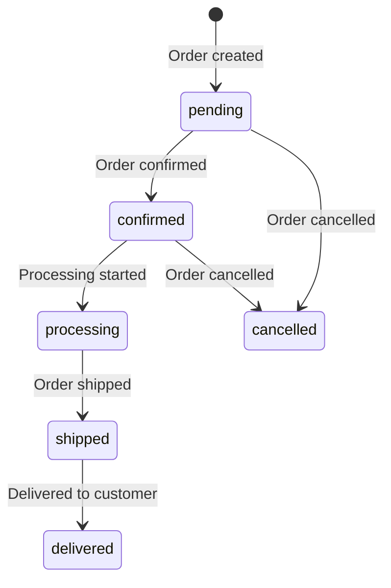

> **Note:** Order status transitions are defined in the DB schema CHECK constraint. No fulfillment or status-update UI or API is implemented. All orders are created with `pending` status.

### 8.6 Quote Status Lifecycle (Schema-Defined)

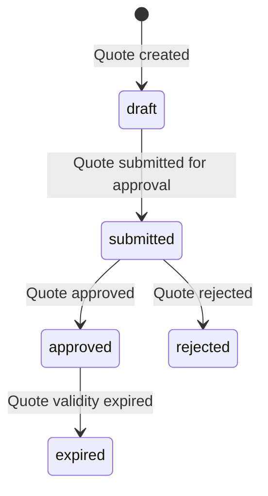

> **Note:** Same as orders — only `draft` creation is implemented. No approval workflow UI exists.

---

## 9. API Analysis

### 9.1 Authentication APIs

| Method | Endpoint | Description | Auth Required | Security Controls |
|---|---|---|---|---|
| GET | `/api/auth/login` | Initiate OIDC flow or demo login | No | PKCE generated; state stored in httpOnly cookie |
| GET | `/api/auth/callback` | Handle OIDC callback; exchange code for tokens | No | State validated; PKCE verifier consumed |
| GET | `/api/auth/logout` | Clear session; redirect to IdP end-session | Yes (cookie) | Clears all 3 auth cookies |
| GET | `/api/auth/permissions` | Resolve full permission map for current context | Yes (session) | 10 parallel Permit.io checks; returns UX permission map |

### 9.2 Commerce APIs

| Method | Endpoint | Description | Auth Required | Authorization Check |
|---|---|---|---|---|
| GET | `/api/products` | List products filtered by sales org | Session | `canAccess(view, products)` + sales org filter + price masking |
| GET | `/api/products/[id]` | Get single product | Session | `canAccess(view, products)` + price masking |
| GET | `/api/orders` | List orders for selected account | Session | `canAccess(view, orders)` + account filter |
| POST | `/api/orders` | Create new order | Session | `canAccess(create, orders)` + account validation |
| GET | `/api/quotes` | List quotes for selected account | Session | `canAccess(view, quotes)` + account filter |
| POST | `/api/quotes` | Create new quote (with line items) | Session | `canAccess(create, quotes)` (procurement persona) |
| GET | `/api/cart` | Get cart for user + account | Session | `canAccess(view, cart)` + user+account filter |
| POST | `/api/cart` | Add item to cart (upsert) | Session | `canAccess(create, cart)` |
| DELETE | `/api/cart` | Remove item from cart | Session | `canAccess(create, cart)` (reuses create permission) |

### 9.3 CRM APIs

| Method | Endpoint | Description | Auth Required | Authorization Check |
|---|---|---|---|---|
| GET | `/api/crm/accounts` | List all accounts for current user | Session | Session required; data scoped to user |
| GET | `/api/crm/user-context/[userId]` | Get full CRM context for user | Session | `userId === session.userId OR role === admin` |
| GET | `/api/crm/user-context/me` | Alias: get own context | Session | Resolves `me` to `session.userId` |

### 9.4 Dashboard APIs

| Method | Endpoint | Description | Auth Required | Authorization Check |
|---|---|---|---|---|
| GET | `/api/dashboard/orders` | Cross-account recent orders (last 20) | Session | Session required; scoped to user's all accounts |

### 9.5 Admin APIs

| Method | Endpoint | Description | Auth Required | Authorization Check |
|---|---|---|---|---|
| GET | `/api/admin/permit-policy` | Fetch live Permit.io roles/resources/assignments | Session | `role === admin` |

### 9.6 Debug APIs

| Method | Endpoint | Description | Auth Required | Authorization Check |
|---|---|---|---|---|
| GET | `/api/debug/traces` | List recent 200 API traces | Session | `role === admin` |
| DELETE | `/api/debug/traces` | Clear all traces | Session | `role === admin` |
| GET | `/api/debug/traces/stream` | SSE stream of live traces | Session | `role === admin` |

### 9.7 Security Controls Summary

| Control | Implementation |
|---|---|
| Authentication | Session cookie validated before every protected request |
| Authorization | `canAccess()` called per resource action; returns `false` on any error |
| Account validation | `userHasAccountAccess()` checks `user_accounts` membership |
| Header injection | `x-user-id` and `x-user-role` injected by middleware; trusted in route handlers |
| Request header | `x-account-id` client-provided; validated against user's account list |
| Data filtering | SQL WHERE clauses applied before DB query (never post-query client-side filter) |
| Price masking | Applied server-side before JSON serialization |
| Fail-closed | All `canAccess()` error paths return `false` |
| Trace logging | All API requests traced (in-memory); accessible to admin only |

---

## 10. Database and Data Model Analysis

### 10.1 IAM-Related Entities

#### `users`
| Column | Type | Notes |
|---|---|---|
| `id` | text PK | Matches Ping JWT `sub` claim |
| `email` | text UNIQUE | |
| `name` | text | |
| `role` | text | CHECK: `admin`, `buyer`, `viewer` |
| `persona` | text | CHECK: `procurement`, `sales`, `finance`, `general`, `GBE` |
| `phone` | text | |
| `hon_id` | text | Honeywell SSO ID |
| `department` | text | |
| `is_super_user` | boolean | Default false; grants admin-equivalent access |
| `user_type` | text | `Partner`, `Customer`, `Internal` |
| `contact_id` | text | SFDC contact ID |
| `active_sales_area` | text | Currently active sales area code |
| `created_at` | timestamptz | |

#### `user_tool_access`
| Column | Type | Notes |
|---|---|---|
| `id` | text PK | e.g. `CTA-003CT0001-TL001` |
| `user_id` | text FK → users | |
| `master_tool_id` | text | TL001, TL003, TL004, TL009 |
| `tool_name` | text | Human-readable name |
| `status` | text | `Approved`, `Pending`, `Rejected`, `Revoked` |
| `requested_date` | timestamptz | |
| `granted_date` | timestamptz | |

#### `accounts`
| Column | Type | Notes |
|---|---|---|
| `id` | text PK | e.g. `001ACC001` |
| `account_name` | text | |
| `account_number` | text | ERP account number |
| `erp_number` | text | SAP ERP number (e.g. `S4H100`) |
| `account_type` | text | `Distributor`, `Partner`, `Customer` |
| `line_of_business` | text[] | e.g. `{Building Automation, Process Technology}` |

#### `user_accounts`
| Column | Type | Notes |
|---|---|---|
| `user_id` | text FK → users | Composite PK |
| `account_id` | text FK → accounts | Composite PK |

#### `sales_orgs`
| Column | Type | Notes |
|---|---|---|
| `id` | text PK | e.g. `BA01`, `PT01` |
| `name` | text | |
| `account_id` | text FK → accounts | |

#### `account_sales_areas`
| Column | Type | Notes |
|---|---|---|
| `account_id` | text FK → accounts | Composite PK |
| `sales_org_id` | text FK → sales_orgs | Composite PK |
| `currency` | text | `USD`, `EUR`, `GBP` |
| `distribution_channel` | text | e.g. `10`, `20`, `30` |
| `division` | text | e.g. `B`, `P`, `A`, `I` |
| `sales_area` | text | Composite: `BA01_10` |

### 10.2 Commerce Entities

#### `products`
| Column | Type | Notes |
|---|---|---|
| `id` | uuid PK | |
| `name` | text | |
| `description` | text | |
| `price` | integer | USD cents; masked to `0` without `view_pricing` |
| `sku` | text UNIQUE | |
| `sales_org_id` | text FK → sales_orgs | **Authorization scope column** |
| `category` | text | |
| `image_url` | text | |

#### `orders`
| Column | Type | Notes |
|---|---|---|
| `id` | uuid PK | |
| `account_id` | text FK → accounts | **Authorization scope column** |
| `user_id` | text FK → users | Creator |
| `status` | text | CHECK: pending/confirmed/processing/shipped/delivered/cancelled |
| `total` | integer | USD cents; computed server-side |

#### `quotes`
| Column | Type | Notes |
|---|---|---|
| `id` | uuid PK | |
| `account_id` | text FK → accounts | **Authorization scope column** |
| `user_id` | text FK → users | Creator |
| `status` | text | CHECK: draft/submitted/approved/rejected/expired |
| `total` | integer | USD cents; discount-adjusted |
| `valid_until` | timestamptz | Optional expiry |

#### `cart_items`
| Column | Type | Notes |
|---|---|---|
| `id` | uuid PK | |
| `user_id` | text FK → users | **Authorization scope column** |
| `account_id` | text FK → accounts | **Authorization scope column** |
| `product_id` | uuid FK → products | |
| `product_name` | text | Denormalized |
| `product_sku` | text | Denormalized |
| `unit_price` | integer | Denormalized at add-time |
| `quantity` | integer | Upserted on duplicate |

### 10.3 Database Indexes (Authorization-Critical)

| Index | Table | Column | Purpose |
|---|---|---|---|
| `idx_products_sales_org_id` | products | sales_org_id | Sales org filter performance |
| `idx_orders_account_id` | orders | account_id | Account scope filter performance |
| `idx_orders_user_id` | orders | user_id | User scope filter |
| `idx_quotes_account_id` | quotes | account_id | Account scope filter performance |

---

## 11. Vendor Evaluation Requirements

This section translates the implemented capabilities into requirements that a replacement or supplementary IAM vendor solution must support.

### 11.1 Authentication Provider Requirements

| # | Capability Description | Why It Is Needed | Current Implementation | Vendor Questions |
|---|---|---|---|---|
| V-AUTH-01 | **OIDC Authorization Code Flow with PKCE (S256)** | Secure browser-based login; prevents code interception | Ping Identity OIDC flow; custom PKCE implementation | Does your platform support S256 PKCE for confidential server-side clients? |
| V-AUTH-02 | **Custom JWT claim mapping (role claim)** | Role delivery from IdP to application without separate lookup | `role` or `custom:role` claim extracted from Ping JWT | Can you configure a custom JWT attribute mapping for application roles? |
| V-AUTH-03 | **End-session (SLO) endpoint** | Complete SSO logout including IdP session | `/signoff` endpoint with `post_logout_redirect_uri` | Do you support OpenID Connect RP-Initiated Logout? |
| V-AUTH-04 | **Configurable token TTL** | Session lifetime control | JWT `exp` claim drives cookie maxAge | What are minimum and maximum configurable access token lifetimes? |
| V-AUTH-05 | **MFA support** (not yet integrated) | Future requirement implied by enterprise context | Not implemented; would be IdP-transparent | What MFA methods do you support? Is step-up MFA available per resource? |
| V-AUTH-06 | **Demo / bypass mode** | Development and demo without live IdP | Demo mode with mock sessions | Do you provide a sandbox or developer tenant for offline testing? |

### 11.2 Authorization Provider Requirements

| # | Capability Description | Why It Is Needed | Current Implementation | Vendor Questions |
|---|---|---|---|---|
| V-AUTHZ-01 | **RBAC with resource-action permissions** | Baseline role-based control over 7 resources × 6 actions | Permit.io `roles.json`; 3 roles (admin, buyer, viewer) | Do you support RBAC with named actions per resource type? |
| V-AUTHZ-02 | **ABAC with user and resource attributes** | Sales org scoping, account scoping, persona checks | `conditions.json` ABAC conditions; passed to `permit.check()` | Can user attributes and resource attributes be evaluated together in a single check call? |
| V-AUTHZ-03 | **ReBAC / Relationship-based grants** | Tool entitlement model: user → tool → resource | `toolBasedRebac()` fallback; `user_tool_access` records | Do you support relationship-based policies (e.g., user has tool grant → user can access resource)? |
| V-AUTHZ-04 | **Policy Decision Point (PDP) — cloud and local** | Low-latency decisions; air-gap support | `PERMIT_PDP_URL` supports both cloud and local Docker PDP | Do you offer a locally deployable PDP container? What is the P99 latency for a single `check()` call? |
| V-AUTHZ-05 | **Bulk permission check (10 checks per page load)** | Populate client-side permission map without multiple round-trips | `GET /api/auth/permissions` issues 10 parallel `permit.check()` calls | Do you support bulk permission check APIs (check multiple action/resource pairs in one request)? |
| V-AUTHZ-06 | **Field-level authorization (price masking)** | Sensitive data attribute hiding based on permission | `maskProductPricing()` — server-side field zeroing | Do you support data masking / field-level policy evaluation natively? |
| V-AUTHZ-07 | **Row-level authorization (SQL filter generation)** | Data-level scoping via database WHERE clauses | `applyProductsFilter()`, `applyOrdersFilter()` inject SQL filters | Do you support generating database-level row filters or ABAC-aware data access policies? |
| V-AUTHZ-08 | **Policy management API** | Live policy matrix visible in admin UI | `GET /v2/schema/{project}/{env}/roles` and `/resources` | Do you expose a REST management API for policy inspection and modification? |
| V-AUTHZ-09 | **Policy fallback / graceful degradation** | Application remains functional if PDP is unreachable | Local `toolBasedRebac()` fallback on PDP connection failure | What is your availability SLA? Do you recommend client-side policy caching for resilience? |
| V-AUTHZ-10 | **Multi-tenant policy scoping** | Policies separated by project and environment | `PERMIT_PROJECT_KEY` / `PERMIT_ENV_KEY` env vars | How do you separate policies for dev / staging / production environments? |

### 11.3 CRM / Identity Data Integration Requirements

| # | Capability Description | Why It Is Needed | Current Implementation | Vendor Questions |
|---|---|---|---|---|
| V-CRM-01 | **Attribute synchronization from external CRM** | User attributes (persona, accounts, tool grants) live in CRM, not IdP | `crmService.ts` fetches from Supabase; attributes injected at check time | Can your platform ingest user attributes from external sources (Salesforce, SAP) for use in policy evaluation? |
| V-CRM-02 | **Dynamic user attribute resolution per request** | Sales orgs change per selected account; attributes are not static | PermitContext rebuilt on every `validateRequest()` call | Can user attributes be provided dynamically per authorization check call rather than statically on the user record? |
| V-CRM-03 | **Multi-account context** | One user operates under multiple sold-to accounts | `x-account-id` header + `user_accounts` junction | How do you handle authorization in multi-tenant scenarios where a user's effective permissions depend on which tenant/account context they are operating in? |

---

## 12. Gap and Enhancement Opportunities

### 12.1 Missing IAM Capabilities

| Gap | Description | Recommendation |
|---|---|---|
| **MFA** | No multi-factor authentication is implemented or enforced | Configure MFA policies in Ping Identity; enforce step-up MFA for admin role or quote creation |
| **Access Request Workflow** | Tool access grants are seeded manually; no UI for requesting tools | Build a tool access request form; implement approval workflow with email notification |
| **Access Approval Workflow** | Quote status transitions (submitted → approved) have no workflow engine | Integrate a workflow engine or use Permit.io's access request features |
| **Role Self-Service** | No UI for admins to modify user roles or tool grants | Admin panel needs CRUD for `user_tool_access` and `users.role` |
| **Audit Log Persistence** | Traces are stored in-memory (max 200, lost on restart) | Persist traces to Supabase `api_traces` table or ship to SIEM (Splunk, Datadog) |
| **JWT Signature Verification** | `getSession()` parses JWT without verifying signature | Implement `verifySession()` using JWKS endpoint to validate JWT signature on every protected request |
| **Token Refresh** | No refresh token handling; sessions expire based on `expiresAt` | Implement silent token refresh using Ping refresh token endpoint |
| **Super User Management** | `isSuperUser` flag exists in schema but is never set in demo data | Build admin UI to toggle super user status; document expected use cases |

### 12.2 Security Improvements

| Improvement | Description | Priority |
|---|---|---|
| **JWT Signature Verification** | Current implementation trusts session cookie contents without re-verifying JWT signature | Critical |
| **HTTPS enforcement** | `secure: true` on cookies is gated to `NODE_ENV === production`; TLS verification is disabled in dev via `NODE_TLS_REJECT_UNAUTHORIZED=0` | High |
| **Rate limiting** | No rate limiting on login, callback, or permission endpoints | High |
| **CSRF protection beyond SameSite** | SameSite=Lax provides basic protection; consider adding CSRF tokens for state-changing requests | Medium |
| **Refresh token rotation** | Refresh tokens (if used) should be rotated on each use | Medium |
| **Secret rotation** | `PING_CLIENT_SECRET` and `PERMIT_API_KEY` have no rotation mechanism | Medium |
| **Input validation** | Request bodies in POST endpoints have minimal validation (e.g., cart quantity, order items) | Medium |

### 12.3 Scalability Improvements

| Improvement | Description |
|---|---|
| **Permission caching** | `GET /api/auth/permissions` issues 10 PDP calls on every page load; consider caching the permission map with short TTL (30s) |
| **CRM context caching** | `getUserContext()` performs 3 Supabase queries per request; Redis cache with account-based invalidation would reduce latency |
| **Persistent trace store** | In-memory trace store is lost on server restart; PostgreSQL-backed trace store needed for production |
| **Horizontal scaling** | In-memory trace store and `globalThis` PDP connection warning state are not shared across Node.js worker processes |
| **Database connection pooling** | Supabase server client is created per-request; use connection pooling (PgBouncer) for production scale |

### 12.4 Governance Improvements

| Improvement | Description |
|---|---|
| **Policy-as-code versioning** | `permit/policies/*.json` files should be version-controlled and deployed via CI/CD to Permit.io |
| **Policy change audit** | Changes to roles, permissions, and tool grants should be logged with change author and timestamp |
| **Access review / certification** | No periodic access review workflow exists; tool grants and account memberships accumulate without review |
| **Role mining** | Current roles are manually designed; production data could be analyzed to validate role boundaries |
| **Least privilege enforcement** | Viewer role has `orders:view` but no tool requirement; this should be gated by TL003 for consistency |

### 12.5 Compliance-Related Improvements

| Improvement | Description | Relevant Standards |
|---|---|---|
| **Audit log completeness** | Current traces include user ID and action but not data entities accessed | SOC 2, ISO 27001 |
| **Data retention policy** | No retention policy for traces, orders, quotes, or cart items | GDPR, CCPA |
| **Consent and privacy** | No consent management for personal data fields (email, phone, department) | GDPR Article 7 |
| **Right to erasure** | No user data deletion mechanism | GDPR Article 17 |
| **Session timeout enforcement** | Session timeout on inactivity is not implemented (only hard expiry on JWT `exp`) | PCI DSS, HIPAA |
| **Segregation of environments** | Dev uses `NODE_TLS_REJECT_UNAUTHORIZED=0`; must be disabled in production | All enterprise compliance frameworks |

---

## 13. Appendix

### 13.1 Architecture Overview

```mermaid
graph TD
  subgraph Browser
    UI[Next.js React SPA]
    PermGate[PermissionGate / usePermission]
    AccCtx[AccountContext]
    AuthCtx[AuthContext]
  end

  subgraph Edge["Next.js Edge Runtime"]
    MW[Middleware - Route Protection]
  end

  subgraph Server["Next.js Server Runtime (Node.js 18+)"]
    AUTH_API[/api/auth/*]
    PERM_API[/api/auth/permissions]
    PRODUCTS_API[/api/products]
    ORDERS_API[/api/orders]
    QUOTES_API[/api/quotes]
    CART_API[/api/cart]
    CRM_API[/api/crm/*]
    ADMIN_API[/api/admin/*]
    DEBUG_API[/api/debug/*]
    CRM_SVC[crmService.ts]
    AUTHZ[canAccess - lib/authorization]
    SESSION[session.ts]
    TRACE[traceStore.ts]
  end

  subgraph External
    PING[Ping Identity OIDC]
    PERMIT[Permit.io PDP]
    SUPABASE[Supabase PostgreSQL]
  end

  UI -->|cookie| MW
  MW -->|x-user-id, x-user-role| Server
  AUTH_API <-->|PKCE flow| PING
  AUTHZ <-->|permit.check()| PERMIT
  CRM_SVC <-->|Supabase JS Client| SUPABASE
  AUTH_API & PRODUCTS_API & ORDERS_API & QUOTES_API & CART_API & CRM_API --> SESSION
  AUTH_API & PRODUCTS_API & ORDERS_API & QUOTES_API & CART_API & CRM_API --> CRM_SVC
  AUTH_API & PRODUCTS_API & ORDERS_API & QUOTES_API & CART_API --> AUTHZ
  ADMIN_API --> PERMIT
  DEBUG_API --> TRACE
  UI <-->|/api/*| Server
  AuthCtx -->|fetchPermissions| PERM_API
  AccCtx -->|fetchContext| CRM_API
```

### 13.2 Component Inventory

| Component | Path | Type | Purpose |
|---|---|---|---|
| `Navbar` | `components/layout/Navbar.tsx` | Client | Account switcher, user menu, auth engine indicator |
| `Sidebar` | `components/layout/Sidebar.tsx` | Client | Navigation with tool-based visibility; active account display |
| `PermissionGate` | `components/permissions/PermissionGate.tsx` | Client | Conditional render based on permission |
| `RoleGate` | `components/permissions/PermissionGate.tsx` | Client | Conditional render based on role |
| `AccessDenied` | `components/permissions/AccessDenied.tsx` | Client | Fallback UI for denied access |
| `AuthContext` | `context/AuthContext.tsx` | Client Context | Session, permissions, login/logout |
| `AccountContext` | `context/AccountContext.tsx` | Client Context | Multi-account management; context switch |
| `usePermission` | `hooks/usePermission.ts` | Client Hook | Single permission check |
| `usePermissions` | `hooks/usePermission.ts` | Client Hook | Batch permission checks |

### 13.3 Configuration Inventory

| Environment Variable | Description | Required |
|---|---|---|
| `PING_ISSUER` | Ping Identity OIDC issuer URL | Yes (for real login) |
| `PING_CLIENT_ID` | Ping OAuth2 client ID | Yes (for real login) |
| `PING_CLIENT_SECRET` | Ping OAuth2 client secret | Yes (for real login) |
| `PING_REDIRECT_URI` | OAuth2 registered callback URI | Yes (for real login) |
| `PING_SCOPES` | Space-separated OIDC scopes | No (default: `openid profile email`) |
| `DEMO_MODE` | Set to `"true"` to force demo mode | No |
| `PERMIT_API_KEY` | Permit.io project API key | Yes (for live PDP) |
| `PERMIT_PDP_URL` | Permit.io PDP endpoint | No (default: cloud PDP) |
| `PERMIT_PROJECT_KEY` | Permit.io project key | No (default: `default`) |
| `PERMIT_ENV_KEY` | Permit.io environment key | No (default: `dev`) |
| `NEXT_PUBLIC_SUPABASE_URL` | Supabase project URL | Yes |
| `NEXT_PUBLIC_SUPABASE_ANON_KEY` | Supabase anonymous key | Yes |
| `SUPABASE_SERVICE_ROLE_KEY` | Supabase service role key (server-side) | Yes |
| `NEXT_PUBLIC_APP_URL` | Public URL of the application | Yes |
| `NODE_TLS_REJECT_UNAUTHORIZED` | Set to `"0"` for dev proxy bypass | No (dev only) |

### 13.4 Technology Inventory

| Technology | Version/Type | Role |
|---|---|---|
| **Next.js** | 14 (App Router) | Full-stack framework; SSR + API routes |
| **React** | 18 | Frontend UI library |
| **TypeScript** | 5+ | Language |
| **Tailwind CSS** | 3 | Styling |
| **Supabase** | Managed PostgreSQL + JS client | Data persistence |
| **Ping Identity (PingOne)** | OIDC v1.0 | Identity Provider |
| **Permit.io** | SDK `permitio` | External authorization PDP |
| **jose** | JWT library | `decodeJwt` for JWT parsing |
| **Node.js** | 18+ | Server runtime (Web Crypto API required for PKCE) |
| **Lucide React** | Icon library | UI icons |
| **Sonner** | Toast library | Notifications |
| **shadcn/ui** | Component library | `badge`, `button`, `card`, `input`, `checkbox`, `tabs`, `separator` |

### 13.5 Database Migration History

| File | Description |
|---|---|
| `supabase/migrations/001_initial.sql` | Core schema: users, accounts, user_accounts, sales_orgs, products, orders, order_items, quotes, quote_items, cart_items |
| `supabase/migrations/002_user_profile_fields.sql` | Add phone, hon_id, department to users |
| `supabase/migrations/003_crm_tables.sql` | CRM columns on accounts/users; account_sales_areas; user_tool_access; seed data for all 5 accounts, 9 sales orgs, 3 users |
| `supabase/002_add_products.sql` | Products table additions |
| `supabase/seed.sql` | Initial data seed |
| `scripts/seed-products.mjs` | 23 products across 9 sales orgs |
| `scripts/setup-permit.mjs` | Permit.io policy initialization script |

---

*End of Document*

---

> **Revision History**
>
> | Version | Date | Author | Changes |
> |---|---|---|---|
> | 1.0 | June 2, 2026 | Reverse-engineered from codebase | Initial release |
