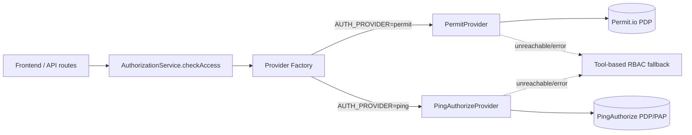

# IAM POC — Enterprise Fine-Grained Authorization Demo

A production-grade Next.js 14 commerce platform demonstrating **RBAC + ABAC + dynamic data filtering** using **Ping Identity** (OIDC + PKCE) and a **pluggable authorization layer** supporting both **Permit.io** and **PingAuthorize**.

---

## Architecture Overview

```
Browser
  └── Next.js 14 App Router (TypeScript + Tailwind CSS)
        ├── Middleware          — route protection, session checks
        ├── React Context       — AuthContext + AccountContext
        ├── API Route Handlers  — server-side auth + data filtering
        └── Supabase PostgreSQL — data layer (with row-level data scoping)

Authorization layers:
  1. Ping Identity OIDC → JWT (role: admin | buyer | viewer)
  2. CRM layer         → accounts + salesOrgs per user
  3. AuthorizationService.checkAccess() → Provider Factory → active provider
         ├── PermitProvider        (Permit.io)
         └── PingAuthorizeProvider (PingAuthorize)
     (each provider falls back to built-in tool-based RBAC if unreachable)
  4. Data filter        → Supabase .in('sales_org_id', allowedOrgs)
```

### Pluggable Authorization Provider



All authorization checks — across every API route — go through the single
`AuthorizationService.checkAccess()` entry point (`lib/authorization/AuthorizationService.ts`).
It never calls Permit.io or PingAuthorize directly; it resolves the *active*
provider via the Provider Factory (`lib/authorization/providerFactory.ts`),
which can be switched at runtime from the **Admin Console → Provider** tab, or
pinned via the `AUTH_PROVIDER` env var (`permit` | `ping`). See
[MIGRATION.md](./MIGRATION.md) for the full migration guide and rationale.

### Three Demo Personas

| User | Role | Persona | Accounts | Sales Orgs |
|---|---|---|---|---|
| `admin@demo.com` | admin | general | ACC100 + ACC200 | All |
| `buyer@demo.com` | buyer | **procurement** | ACC100 + ACC200 | IA001, BA002 (ACC100) · PA001 (ACC200) |
| `viewer@demo.com` | viewer | general | ACC100 | IA001, BA002 |

### What Each Role Can Do

| Feature | Admin | Buyer | Viewer |
|---|---|---|---|
| View products | ✅ | ✅ | ✅ (no price) |
| View pricing | ✅ | ✅ | ❌ |
| Add to cart | ✅ | ✅ | ❌ |
| View orders | ✅ | ✅ | ✅ |
| Create orders | ✅ | ✅ | ❌ |
| View quotes | ✅ | ✅ | ❌ |
| Create quotes | ✅ | ✅ (procurement only) | ❌ |
| Admin panel | ✅ | ❌ | ❌ |

---

## Quick Start (Demo Mode — No External Services Required)

The app runs fully in **demo mode** without Ping Identity, Permit.io, or Supabase.

### 1. Install dependencies

```bash
cd C:\Users\H593820\Dev\IAMpoc
npm install
```

### 2. Start the dev server

```bash
npm run dev
```

### 3. Open the app

```
http://localhost:3000
```

You'll be redirected to `/login`. Click any of the **three demo persona buttons** to log in instantly — no passwords, no external services needed.

---

## Running the Dev Server

```bash
npm run dev       # http://localhost:3000  (hot reload)
npm run build     # production build
npm run start     # serve the production build
npm run lint      # ESLint check
```

---

## Project Structure

```
IAMpoc/
├── app/
│   ├── (auth)/
│   │   ├── login/page.tsx          # Login UI (demo personas + Ping SSO)
│   │   └── callback/page.tsx       # OIDC callback loading screen
│   ├── (portal)/                   # Authenticated portal (Navbar + Sidebar)
│   │   ├── layout.tsx              # Portal shell
│   │   ├── dashboard/page.tsx      # Permission-gated widgets
│   │   ├── products/page.tsx       # Products filtered by salesOrg (ABAC)
│   │   ├── orders/page.tsx         # Orders filtered by account
│   │   ├── quotes/page.tsx         # Quotes — create gated by persona
│   │   ├── cart/page.tsx           # Cart management
│   │   └── admin/page.tsx          # Admin only (role guard in middleware)
│   ├── 403/page.tsx                # Access denied page
│   ├── api/
│   │   ├── auth/login/             # Initiates PKCE flow
│   │   ├── auth/callback/          # Token exchange
│   │   ├── auth/logout/            # Clears session
│   │   ├── auth/permissions/       # Returns PermissionMap for current user
│   │   ├── crm/accounts/           # User's associated accounts
│   │   ├── crm/user-context/[id]/  # Full CRM context per user
│   │   ├── products/               # Products with salesOrg filter
│   │   ├── orders/                 # Orders with account filter
│   │   ├── quotes/                 # Quotes with persona ABAC check
│   │   └── cart/                   # Cart CRUD
│   ├── globals.css                 # Tailwind + shadcn/ui CSS variables
│   ├── layout.tsx                  # Root layout (AuthProvider + AccountProvider)
│   └── page.tsx                    # Root redirect
├── components/
│   ├── layout/
│   │   ├── Navbar.tsx              # Top bar with AccountSwitcher + user menu
│   │   ├── Sidebar.tsx             # Nav with PermissionGate per item
│   │   └── AccountSwitcher.tsx     # Sold-to account dropdown
│   └── permissions/
│       ├── PermissionGate.tsx      # Conditional render by permission
│       └── AccessDenied.tsx        # 403 UI component
├── context/
│   ├── AuthContext.tsx             # Session, permissions, login/logout
│   └── AccountContext.tsx          # Account switching, CRM context
├── hooks/
│   └── usePermission.ts            # usePermission(action, resource) hook
├── lib/
│   ├── api/validateRequest.ts      # Shared API auth + CRM context helper
│   ├── auth/
│   │   ├── pingConfig.ts           # Ping Identity OIDC endpoints
│   │   ├── pkce.ts                 # PKCE code_verifier / challenge (RFC 7636)
│   │   └── session.ts              # httpOnly cookie session management
│   ├── authorization/
│   │   ├── canAccess.ts            # Backward-compatible wrapper → AuthorizationService
│   │   ├── AuthorizationService.ts # THE authorization entry point (single call site for all routes)
│   │   ├── providerFactory.ts      # Resolves active provider (env var + runtime override)
│   │   ├── providers/
│   │   │   ├── AuthorizationProvider.ts  # Pluggable provider interface
│   │   │   ├── PermitProvider.ts         # Permit.io implementation
│   │   │   └── PingAuthorizeProvider.ts  # PingAuthorize implementation
│   │   ├── fallbackRebac.ts        # Shared tool-based RBAC fallback (both providers)
│   │   ├── decisionCache.ts        # Short-TTL in-memory decision cache
│   │   ├── auditLog.ts             # In-memory authorization audit trail
│   │   ├── filterByPermission.ts   # Supabase query filters (data-level ABAC)
│   │   └── permitClient.ts         # Permit.io SDK singleton
│   ├── crm/
│   │   ├── crmService.ts           # CRM service functions (getUserContext, etc.)
│   │   └── mockData.ts             # Simulated CRM data (users, accounts, salesOrgs)
│   └── supabase/
│       ├── client.ts               # Browser Supabase client (anon key)
│       └── server.ts               # Server Supabase client (service key, bypasses RLS)
├── services/
│   └── ping-authorize/
│       ├── client.ts               # REST client (Basic Auth, retries, X-Respond-With)
│       ├── types.ts                # PingAuthorize domain types (Policy, PolicySet, Decision...)
│       ├── demoStore.ts            # In-memory demo policy sets/policies (no PAP/PDP required)
│       ├── policySets.ts           # Policy Set CRUD (real PAP or demo store)
│       ├── policies.ts             # Policy CRUD (real PAP or demo store)
│       └── decisions.ts            # PDP evaluation (real PDP call or local evaluator fallback)
├── middleware.ts                   # Route protection + session injection
├── permit/policies/
│   ├── roles.json                  # Role definitions + permissions
│   ├── resources.json              # Resource + action definitions
│   └── conditions.json             # ABAC conditions (salesOrg filter, procurement check)
├── supabase/
│   ├── migrations/001_initial.sql  # Full DB schema
│   └── seed.sql                    # Demo data (users, accounts, products, orders, quotes)
├── types/index.ts                  # All shared TypeScript types
└── .env.local                      # Environment variables (demo values pre-filled)
```

---

## Key Authorization Concepts Demonstrated

### 1. RBAC — Role-Based Access Control
The `admin | buyer | viewer` role from the JWT determines base permissions. Enforced in `lib/authorization/canAccess.ts`.

### 2. ABAC — Attribute-Based Access Control
**Persona-based**: Only `buyer` users with `persona = "procurement"` can **create quotes**.  
**Sales org filter**: Products are filtered by `allowedSalesOrgs` — derived from the user's CRM account context.

### 3. Data-Level Authorization
The same `/api/products` endpoint returns **different products** for different users:
- Ryan Buyer on ACC100 → sees IA001 + BA002 products
- Ryan Buyer on ACC200 → sees PA001 products
- Victor Viewer on ACC100 → sees same products but **price = 0** (masked)

This is enforced via `applyProductsFilter()` which builds a Supabase `.in('sales_org_id', [...])` WHERE clause server-side.

### 4. Multi-Account Commerce
Buyers can switch between sold-to accounts (Honeywell US / Honeywell EU) via the **AccountSwitcher** in the navbar. Switching account:
- Reloads the permission map
- Changes which products, orders, quotes, and cart items are visible
- Updates `selectedSalesOrgs` for all data queries

### 5. Authorization Never in UI
All security enforcement is server-side in Route Handlers. `PermissionGate` and `usePermission()` are **UX-only** — they hide elements for usability but are not a security boundary.

---

## Connecting Real Services

### Ping Identity (PingOne)

1. Create a PingOne developer account at https://www.pingidentity.com/
2. Create an **OIDC application** (Authorization Code + PKCE)
3. Set redirect URI: `http://localhost:3000/api/auth/callback`
4. Update `.env.local`:

```env
PING_ISSUER=https://auth.pingone.com/YOUR_ENV_ID/as
PING_CLIENT_ID=your-client-id
PING_CLIENT_SECRET=your-client-secret
PING_REDIRECT_URI=http://localhost:3000/api/auth/callback
```

Add custom claims to the token:
- `role` → one of `admin`, `buyer`, `viewer`
- `persona` → one of `procurement`, `sales`, `finance`, `general`

### Supabase

1. Create a project at https://supabase.com/
2. Run the migration: **Supabase Dashboard → SQL Editor** → paste `supabase/migrations/001_initial.sql`
3. Run seed data: paste `supabase/seed.sql`
4. Update `.env.local`:

```env
NEXT_PUBLIC_SUPABASE_URL=https://your-project.supabase.co
NEXT_PUBLIC_SUPABASE_ANON_KEY=your-anon-key
SUPABASE_SERVICE_KEY=your-service-role-key
```

### Permit.io

1. Sign up at https://app.permit.io/
2. Create a new project
3. Import the policy files from `permit/policies/`:
   - Create resources from `resources.json`
   - Create roles + assign permissions from `roles.json`
   - Add ABAC conditions from `conditions.json`
4. Copy your API key and update `.env.local`:

```env
PERMIT_API_KEY=permit_key_YOUR_ACTUAL_KEY
PERMIT_PDP_URL=https://cloudpdp.api.permit.io
```

> When `PERMIT_API_KEY` starts with `permit_key_demo` or is absent, the app automatically falls back to the built-in RBAC engine in `lib/authorization/canAccess.ts`.

### PingAuthorize

1. Set `AUTH_PROVIDER=ping` in `.env.local` (or leave it as `permit` and switch at runtime from **Admin Console → Provider**).
2. If you have a real PingAuthorize deployment, set `PING_PAP_URL`, `PING_PDP_URL`, `PING_USERNAME`, `PING_PASSWORD`.
3. If those are left unset, the app runs PingAuthorize in **local demo mode** — a seeded in-memory policy store (`services/ping-authorize/demoStore.ts`) and a local decision evaluator (`services/ping-authorize/decisions.ts`) — so Policy Sets, Policies, and the Decision Testing Console all work without any external PingAuthorize instance.
4. Manage policy sets/policies from the **Admin Console → Policy Sets / Policies** tabs, and compare decisions against Permit.io from **Admin Console → Decision Testing**.

> See [MIGRATION.md](./MIGRATION.md) for the full multi-provider architecture, migration steps, and what's a verified fact vs. a documented simplification for PingAuthorize's PAP/PDP contracts.

---

## Environment Variables Reference

| Variable | Required | Description |
|---|---|---|
| `NEXT_PUBLIC_APP_URL` | Yes | Base URL (e.g. `http://localhost:3000`) |
| `PING_ISSUER` | No* | PingOne authorization server issuer URL |
| `PING_CLIENT_ID` | No* | OIDC client ID |
| `PING_CLIENT_SECRET` | No* | OIDC client secret |
| `PING_REDIRECT_URI` | No* | Must match Ping app config |
| `NEXT_PUBLIC_SUPABASE_URL` | No* | Supabase project URL |
| `NEXT_PUBLIC_SUPABASE_ANON_KEY` | No* | Supabase anon/public key |
| `SUPABASE_SERVICE_KEY` | No* | Supabase service role key (server-side only) |
| `PERMIT_API_KEY` | No* | Permit.io API key |
| `PERMIT_PDP_URL` | No* | Permit.io PDP URL |
| `AUTH_PROVIDER` | No | Active authorization provider: `permit` \| `ping` (default `permit`) |
| `PING_PAP_URL` | No* | PingAuthorize Policy Administration Point base URL |
| `PING_PDP_URL` | No* | PingAuthorize Policy Decision Point base URL |
| `PING_USERNAME` | No* | PingAuthorize Basic Auth username |
| `PING_PASSWORD` | No* | PingAuthorize Basic Auth password |
| `SESSION_SECRET` | Yes | 32+ char secret for session signing |

*Not required in demo mode — the app uses mock data and fallback RBAC when these are absent.

---

## Demo Mode Behavior

When running without real credentials, the app uses:

| Layer | Demo behavior |
|---|---|
| Authentication | `createDemoSession(persona)` creates a mock JWT session |
| CRM | `lib/crm/mockData.ts` returns hardcoded users, accounts, salesOrgs |
| Authorization | Fallback RBAC in `canAccess.ts` (no Permit.io API calls) |
| Database | API routes that call Supabase will return empty arrays (gracefully) |

The demo is fully functional for exploring role/permission differences without any external accounts.
